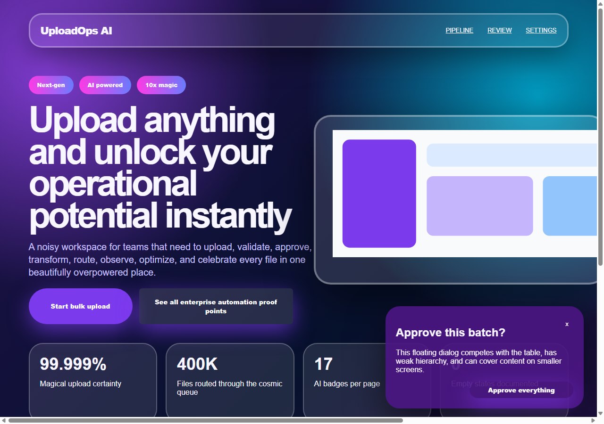
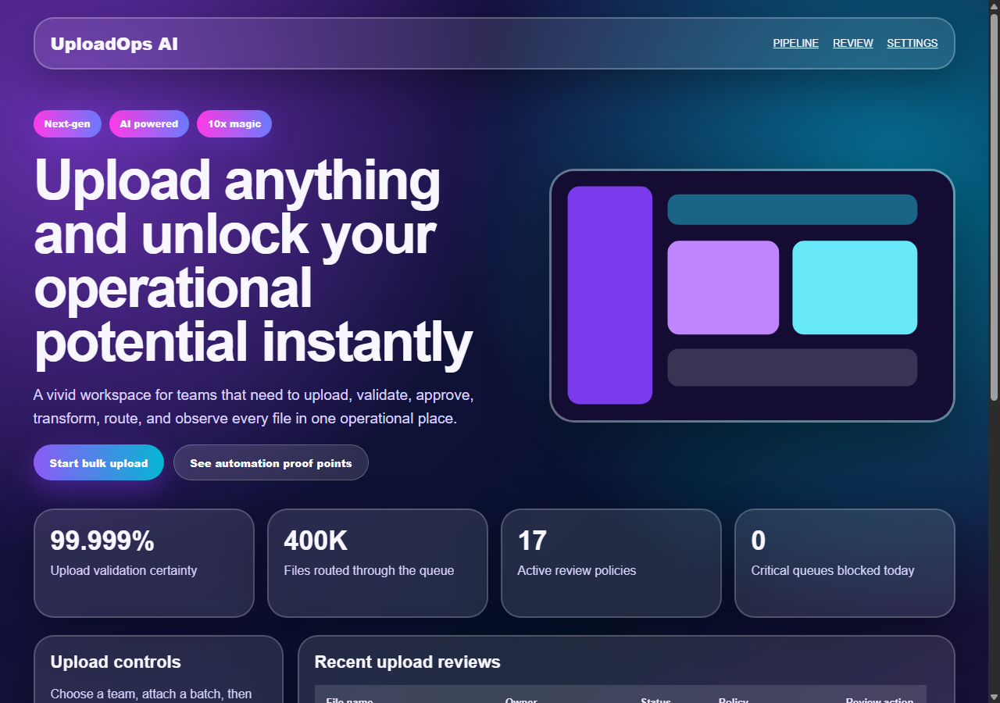

# Webcraft Skills

English | [中文](./README_zh_CN.md)

UI audit and fix skill for Codex and Claude Code, for inspecting and repairing rough AI-generated web UI.

AI coding tools can generate code quickly, but their UI often feels too crowded, flashy, inconsistent, or obviously AI-generated.

---

# What Is This?

Webcraft Skills is a UI quality system for AI agents.

It is not a UI framework, design system, component library, or product builder.

The current verified scope is focused: **audit existing UI and fix confirmed audit findings**.

The broader goal is:

- audit layout, typography, color, borders, radius, modals, responsive behavior, and interaction states
- fix rough AI-generated UI based on concrete findings
- eventually build and polish more realistic, restrained web UI
- refine the core reusable skill first, then gradually expand Codex, Claude, Cursor, and plain prompt adapters
- help AI act more like a senior UI/UX and frontend reviewer

The currently tested workflows are audit and fix. Claude Code command prompt files are included, with `/ui-audit` and `/ui-fix` as the recommended stable commands. In Codex, use `/skills`, `$webcraft-skills`, or explicit natural-language invocation.

---

# Self-Test Example

This repository includes a small audit / fix self-test. The rough page intentionally includes horizontal overflow, overlay conflicts, broken media ratio, mismatched native controls, table overflow, and AI-template noise. The fixed version keeps the original purple/cyan gradient and glass-card style while tightening layout, controls, tables, states, and readability.

| Before audit | After fix |
| --- | --- |
|  |  |

See the full report in [`examples/reports/self-audit-rough-ui-report.md`](./examples/reports/self-audit-rough-ui-report.md), and the test page in [`examples/test-cases/self-audit-rough-ui/`](./examples/test-cases/self-audit-rough-ui/).

---

# Quick Start

## Current Recommended Install

Install the skill with npx:

```bash
npx webcraft-skills install --agent codex
```

For Claude Code:

```bash
npx webcraft-skills install --agent claude
```

To install for both:

```bash
npx webcraft-skills install --agent all
```

For Codex, this installs:

```text
~/.agents/skills/webcraft-skills
~/.codex/skills/webcraft-skills
```

The installer writes both Codex-compatible paths to support different current clients.

For Claude Code, it installs:

```text
~/.claude/skills/webcraft-skills
~/.claude/commands/*.md
```

## Usage

In Codex, invoke `webcraft-skills` with natural language. Include the audit depth, target scope, and areas of concern when possible:

```text
Use webcraft-skills to run a Standard Audit on the current website.
Use webcraft-skills to run a Quick Audit on the homepage and only report obvious issues.
Use webcraft-skills to run a Standard Audit on the upload flow, focusing on forms, states, and mobile.
Use webcraft-skills to run a Deep Audit on all admin pages before launch.
```

You can also run `/skills` or type `$` in Codex to mention the installed `webcraft-skills` skill.

In Claude Code, use the installed slash command prompts. Text after the command is a prompt convention for the agent, not a separate CLI parser:

```text
/ui-audit Standard Audit for the whole site
/ui-audit Quick Audit for the homepage, only report obvious issues
/ui-audit Standard Audit for the upload flow, focusing on forms, states, and mobile
/ui-audit Deep Audit for all admin pages before launch
```

### Audit: Find Issues

`Audit` finds issues, provides evidence, and recommends a fix order. It does not edit code by default. Use it when you want to understand UI risk before changing the implementation.

Audit depth:

- `Quick Audit`: fast pass for "take a quick look" requests. Reports only Critical and obvious Major issues, up to 5 findings.
- `Standard Audit`: default mode. Reports Critical, Major, and a small number of high-value Minor issues, usually 8 to 12 findings.
- `Deep Audit`: full pass for launch readiness or strict review. Uses the full rubric, scoring model, content stress tests, and more viewport checks.

These three audit depths now use structured budgets for finding counts, severity scope, scoring expectations, and viewport coverage, so agents are less likely to make Quick Audit too heavy or Deep Audit too shallow.

Default viewport checks are 375px, 768px, and 1280px. Deep Audit also checks smaller mobile widths, larger tablet widths, 1440px, and 1920px when the project can be run or inspected that way.

Common audit targets:

- Current page: quickly check the page you are editing for obvious layout, hierarchy, responsive, or state issues.
- Specific page: homepage, pricing page, login page, settings page, article page, checkout page.
- Specific feature: upload flow, search and filters, bulk actions, signup/login, edit forms, confirmation dialogs.
- Specific module: all admin pages, user center, content management, order flow, analytics dashboard.
- Specific viewport or device: mobile only, 375px, tablet breakpoints, desktop breakpoints.
- Pre-launch check: run a `Deep Audit` for stricter coverage and a fix priority order.

### Fix: Repair Issues

`Fix` edits code based on confirmed audit/review findings or a user-specified issue. Its goal is to make confirmed problems usable, clear, and consistent, not to casually redesign the whole page.

In Codex:

```text
Use webcraft-skills to fix Critical and Major issues from the last audit.
Use webcraft-skills to fix only the homepage mobile horizontal overflow.
Use webcraft-skills to fix form states, error messages, and loading states in the upload flow.
Use webcraft-skills to fix native select controls in admin pages so they match the existing component system.
Use webcraft-skills to propose a fix plan first, without editing code yet.
```

In Claude Code:

```text
/ui-fix Critical and Major issues from the last audit
/ui-fix only fix homepage mobile horizontal overflow
/ui-fix fix form states, error messages, and loading states in the upload flow
/ui-fix fix native select controls in admin pages so they match the existing component system
/ui-fix propose a fix plan first, without editing code yet
```

Common fix scopes:

- By severity: fix only `Critical`, or fix `Critical` and `Major`.
- By page: fix only the homepage, login page, settings page, checkout page, etc.
- By feature: fix upload, search and filters, bulk actions, edit forms, confirmation dialogs.
- By issue type: fix responsive overflow, component states, form errors, modal close behavior, inconsistent visual tokens.
- By plan: ask for a `fix plan` first, then confirm before editing code.

`Fix` preserves the existing visual system, copy, business logic, and technical stack by default. Unless you explicitly request a redesign or specify a preset, it should not turn the page into a different visual direction.

## Cursor

Cursor support is not part of the stable install path yet. For now, use the audit and fix guidance manually if you know how to configure Cursor Project Rules.

## Plain Prompt

Plain prompt usage is not part of the stable release yet.

## Project Extensions

Create `.webcraft-skills/EXTEND.md` and `.webcraft-skills/config.json` in the target project to override default audit standards, brand constraints, radius scale, viewports, and visual rules.

For user-level defaults and priority rules, see [`docs/configuration.md`](./docs/configuration.md).

---

# Capabilities

Stable:

- audit UI quality with Quick, Standard, or Deep Audit modes
- fix confirmed audit findings

Experimental / not yet fully tested:

- review a page, component, or screenshot
- refine existing UI without changing product meaning
- build a page or site
- list and apply visual presets

---

# Presets

The package currently includes one bundled preset: `cinematic-minimal`.

Calm cinematic interfaces with:

- restrained motion
- warm dark tones
- spacious layouts
- quiet product feeling

More presets will be added when they are ready.

---

# Philosophy

Good UI is usually restrained.

This project focuses on helping AI generate interfaces that feel:

- cleaner
- calmer
- more intentional
- more realistic
- less artificial

---

# License

MIT
